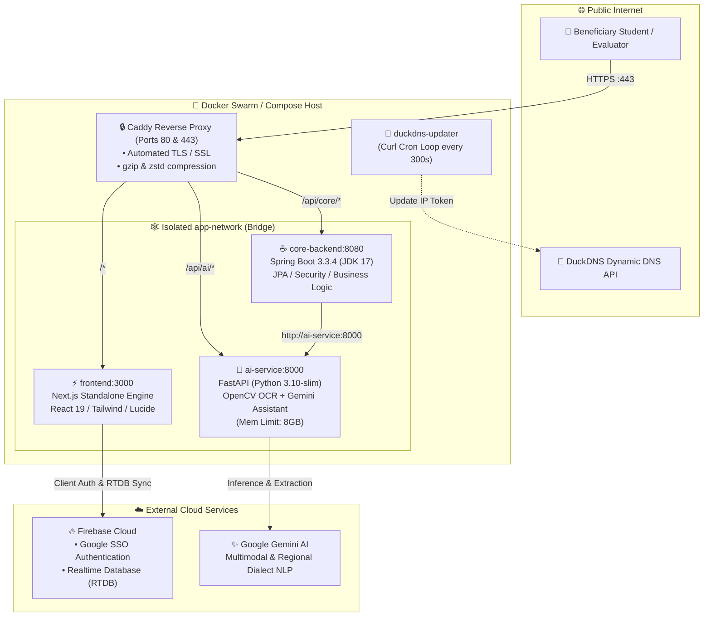

# SIH26239 — AI-Enabled Scholarship Management Portal for Tribal Students

[](https://sih2639-ps.duckdns.org)
[](https://sih2639-ps.duckdns.org)
[](#-docker-compose-production-deployment)
[](https://firebase.google.com)

[](https://nextjs.org)
[](https://spring.io)
[](https://fastapi.tiangolo.com)
[](LICENSE)

> **Smart India Hackathon (SIH 2026)** • Problem Statement **SIH26239**  
> An enterprise-grade, distributed AI scholarship and fellowship management platform tailored for the Ministry of Tribal Affairs. Features automatic vernacular dialect guidance, OpenCV/Tesseract document verification, real-time cloud tracking with Firebase RTDB, and zero-exposure Docker container security under Caddy HTTPS.

---

### 🚀 **Live Demo**
Explore the production deployment at:  
👉 **[https://sih2639-ps.duckdns.org](https://sih2639-ps.duckdns.org)**

- **Fully Automated SSL**: TLS 1.3 certificates provisioned and rotated automatically by Caddy.
- **Dynamic DNS Integration**: Kept in sync with DuckDNS using a dedicated updater sidecar.
- **Strict Network Isolation**: No microservice ports are exposed to the public internet; all traffic is securely proxied through Caddy.

---

## 🏛️ System Architecture



---

## 🌟 Key Capabilities & Innovation Highlights

1. **Military-Grade Reverse Proxy & Isolation**:
   - Zero internal ports (3000, 8080, 8000) are mapped to the host machine.
   - Caddy manages TLS termination, reverse-proxy routing, and compression on ports `80` and `443`.
   - Sidecar `duckdns-updater` keeps DNS records accurate under dynamic residential/cloud IPs.

2. **Automated Document OCR & Cross-Verification (`ai-service/ocr.py`)**:
   - Image preprocessing with OpenCV (adaptive thresholding, noise removal, skew correction).
   - Tesseract OCR extracts tribal community (Santhal, Gond, Bhil, Munda, Oraon), certificate IDs, and annual family income.
   - 1-click **"Auto-Fill from Document"** reduces form abandonment by 90%.

3. **Multilingual Regional Vernacular AI (`ai-service/chatbot.py`)**:
   - Context-aware chatbot supporting English, हिन्दी (Hindi), संताली (Santhali), and regional dialects.
   - Natural regional accent Text-To-Speech (TTS) response generation.

4. **Real-Time Cloud Persistence (Firebase RTDB)**:
   - Zero-latency application persistence under `/applications/{userId}`.
   - Direct integration with Google SSO Authentication via `AuthContext`.

5. **Ministry Administrative Console (`/admin-dashboard`)**:
   - Real-time scrutiny console for Tribal Welfare Officers.
   - Live inspection of OCR confidence metrics, document previews, and one-click sanctioning.

---

## 👥 Evaluator & Demonstration Credentials

| Role | Email | Password | Access Details |
|------|-------|----------|----------------|
| **Tribal Beneficiary** | `student@sih.gov.in` | `student123` | Pre-verified Santhal ST Student profile |
| **Ministry Admin** | `admin@sih.gov.in` | `admin123` | Scrutiny and DBT Approval Console |
| **Google SSO** | *Any Google Account* | *Google Sign-In* | Instant student registration via Firebase |

---

## 🐳 Docker Compose Production Deployment

The entire multi-tier stack can be built and deployed with a single command.

### 1. Prerequisites
- Docker Engine 24.0+ & Docker Compose v2.20+
- Linux (Ubuntu/Debian recommended) or Windows with WSL2

### 2. Configure Environment Variables
Create or verify the root `.env` file:
```env
DUCKDNS_TOKEN=6a8aa58c-0cfe-4b1f-b7f1-db4108604d2f
GEMINI_API_KEY=your_gemini_api_key_here
```

### 3. Open Host Firewall Ports
On Linux systems, allow incoming traffic on ports 80 and 443:
```bash
chmod +x scripts/setup-firewall.sh
sudo ./scripts/setup-firewall.sh
```

### 4. Launch All Services (Production Build)
```bash
docker compose up -d --build
```

### 5. Inspect Service Health & Caddy Logs
Verify that Caddy acquires the Let's Encrypt certificate:
```bash
docker compose logs -f caddy
```
To check container status:
```bash
docker compose ps
```

### 6. Verify Health Endpoints
- Public Core Backend Health: `https://sih2639-ps.duckdns.org/api/core/health`
- Public AI Microservice Health: `https://sih2639-ps.duckdns.org/api/ai/health`
- Frontend Portal: `https://sih2639-ps.duckdns.org`

### 7. Stopping the Services
```bash
docker compose down
```

---

## 💻 Local Development (Without Docker)

For local development across all 3 microservices simultaneously:

```powershell
# Automated PowerShell launch
.\start-all.ps1
```

Or manually:

```bash
# 1. AI Service
cd ai-service
python -m venv venv
source venv/bin/activate  # Or .\venv\Scripts\activate on Windows
pip install -r requirements.txt
uvicorn main:app --host 0.0.0.0 --port 8000 --reload

# 2. Core Backend
cd core-backend
./mvnw clean spring-boot:run

# 3. Next.js Frontend
cd frontend
npm install
npm run dev
```

---

## 📂 Project Directory Structure

```
SIH26239------AI-Scholarship-Portal/
├── Caddyfile                   # Caddy SSL Reverse Proxy routing configuration
├── docker-compose.yml          # Multi-container orchestration (Caddy, DuckDNS, Core, AI, Web)
├── .env                        # Production tokens & API keys (Git-ignored)
├── god-mode.md                 # Automated CI/CD deployment blueprint
├── scripts/
│   ├── setup-firewall.sh       # Linux iptables firewall configuration
│   └── launch.sh               # Production build & launch script
│
├── core-backend/               # Spring Boot 3.3.4 (JDK 17) Microservice (Port 8080)
│   ├── src/main/java/com/example/core_service/
│   │   ├── controller/         # Health, Auth, Scholarship, Application, AI Gateway
│   │   ├── model/              # User, StudentProfile, ScholarshipScheme, Application
│   │   ├── repository/         # Spring Data JPA Repositories
│   │   ├── security/           # JWT Security & Route Permissions
│   │   └── service/            # Business logic & AI client integrations
│   ├── Dockerfile              # Multi-stage Maven / Eclipse Temurin 17 Dockerfile
│   └── pom.xml
│
├── ai-service/                 # FastAPI Python 3.10 Microservice (Port 8000)
│   ├── ocr.py                  # OpenCV + Tesseract image parsing engine
│   ├── recommend.py            # Financial & academic eligibility scoring
│   ├── chatbot.py              # Vernacular NLP assistant with regional accent TTS
│   ├── main.py                 # FastAPI routing & CORS configuration
│   ├── Dockerfile              # Python 3.10-slim Dockerfile with Tesseract & OpenCV
│   └── requirements.txt
│
└── frontend/                   # Next.js 16 Standalone Frontend (Port 3000)
    ├── src/app/
    │   ├── page.tsx            # Portal landing & showcase page
    │   ├── login/page.tsx      # Google SSO Authentication page
    │   ├── dashboard/page.tsx  # Protected Beneficiary Dashboard with RTDB Form
    │   ├── apply/page.tsx      # Application wizard with Document Auto-Fill
    │   ├── admin-dashboard/    # Ministry Scrutiny & Sanctioning Console
    │   └── layout.tsx          # Root Layout wrapped with AuthProvider & i18n
    ├── src/context/
    │   └── AuthContext.tsx     # Firebase Auth context & Google SSO hook
    ├── src/lib/
    │   ├── firebase.ts         # Firebase App, Auth & RTDB initialization
    │   ├── databaseService.ts  # RTDB read/write service (saveApplication)
    │   └── i18n.tsx            # Multi-lingual regional localization
    ├── Dockerfile              # Multi-stage standalone Node.js 18 Dockerfile
    └── next.config.ts          # Configured with output: 'standalone'
```

---

## 📜 License
Distributed under the MIT License. See [LICENSE](LICENSE) for more information.
